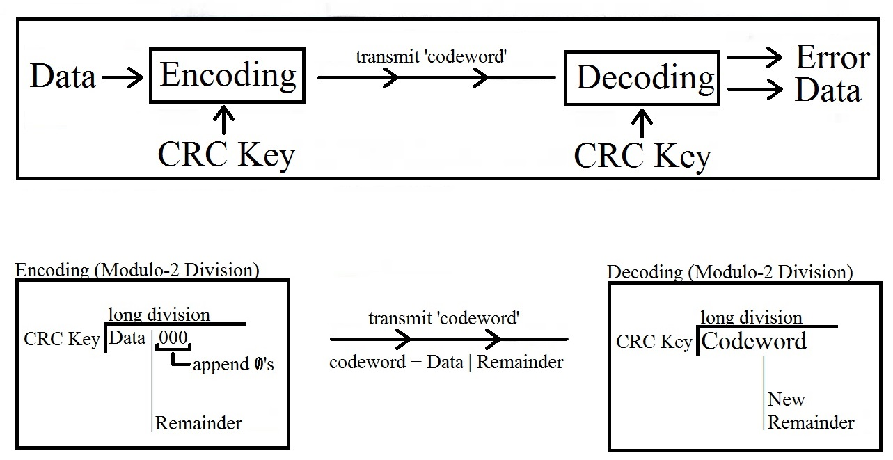

#     CRC Program Overview
***

The CRC operation is useful for error checking data. Errors can be randomly created in transmitted  data due to electromagnetic interference in the transmission medium. These errors corrupt the transmitted data. We can't necessarily correct these errors. However, we can check to see if an error has occurred. To do this, CRC error checking is one such method. 

CRC error checking is a popular method because of its effectiveness, and ease of implementation. A good CRC can catch literally billions of errors. Likewise, the operations necessary for CRC error checking can be implemented using simple state machines. 

## CRC Gui

This GUI is pretty simple. To download, import the "crc_Program.z" file onto your computer. This is a simple zipped folder. Change the file type to .zip and unzip like normal. The program, CRC_Program.exe, will run within this folder wherever you put it in your computer. However, the .exe requires the "SupportFiles" folder to go with it in order to work. 

This program is based on a number of dependencies
1. crc_top.py
2. crc_bottom.py
3. crc_gui.py
4. CRC_print_V2.py
5. Tooltip.py
6. CRC_Generator.py

7. Tkinter
8. Os
9. DateTime

I might come along and simplify these into one folder, but right now they are separate projects. 

The GUI also has some built in help files, PDF's that will open from the drop-down "Help" menu. 

## CRC GUI, how it looks

## CRC Operation Flow Diagram

## CRC Simplified Example

